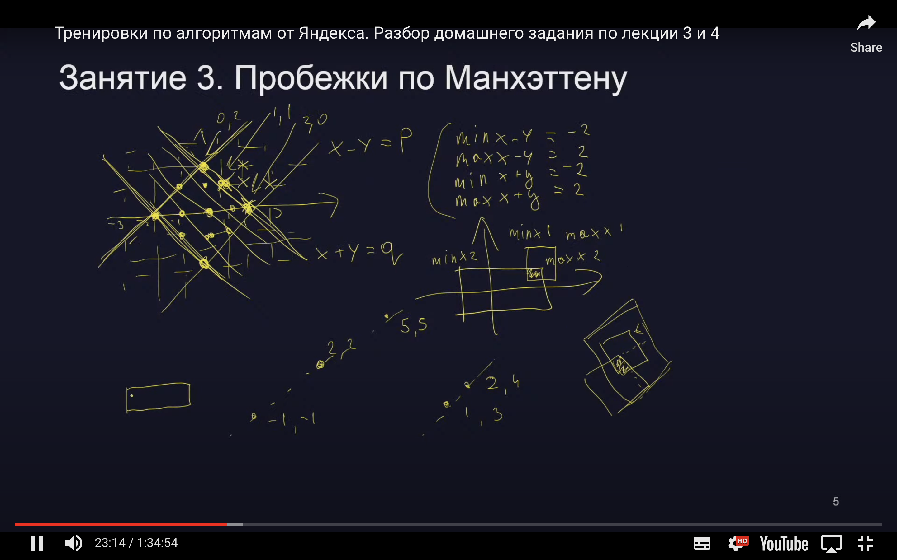

Домашнее задание по лекции № 3 «Множества»

[https://contest.yandex.ru/contest/27663/problems/J/](https://contest.yandex.ru/contest/27663/problems/J/)

# J. Пробежки по Манхэттену

Дороги Нью-Манхэттена устроены следующим образом. С юга на север через каждые сто метров проходит авеню, с запада на восток через каждые сто метров проходит улица. Авеню и улицы нумеруются целыми числами. Меньшие номера соответствуют западным авеню и южным улицам.

---

[Яндекс. Тренировки по алгоритмам июнь 2021](https://yandex.ru/yaintern/algorithm-training_1)
